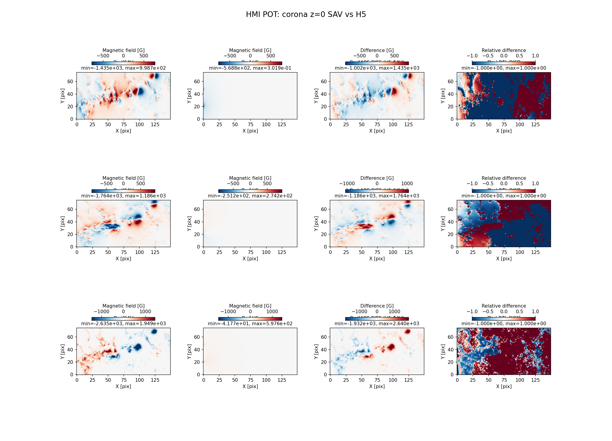
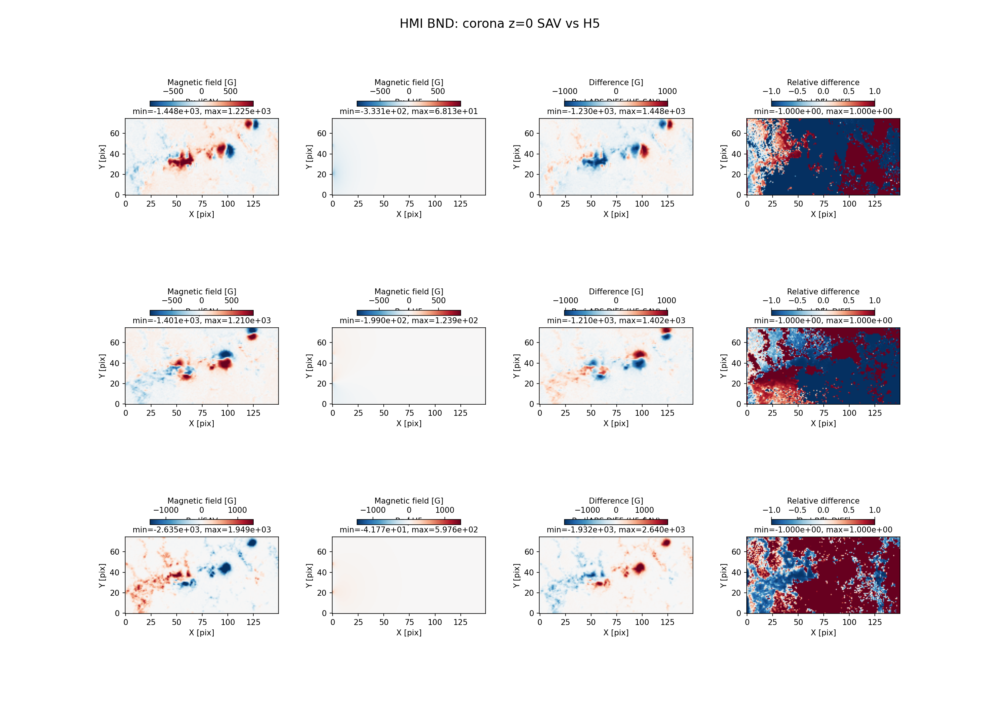
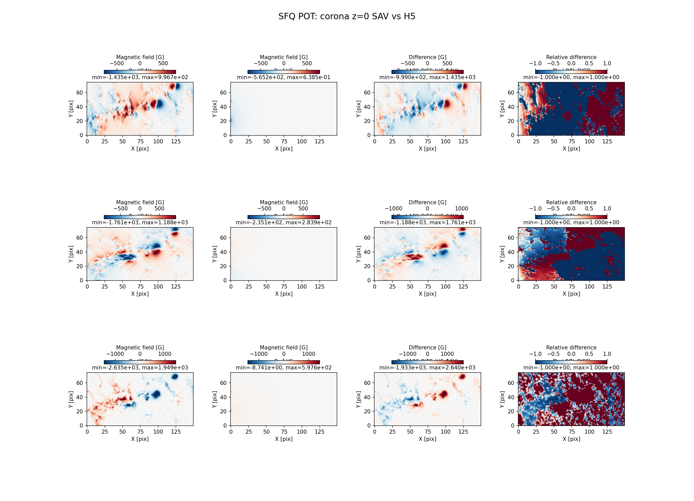
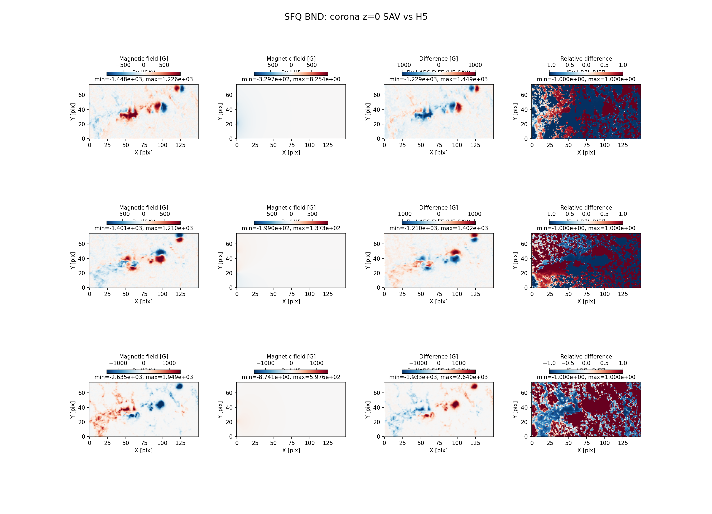

# pyAMPP vs GX/IDL Full Stage Assessment

Date: 2026-02-13  
Scope: Stage-by-stage H5 vs SAV comparison for both HMI and SFQ branches.

## Compared Model Series

- HMI SAV series: `/Users/gelu/Library/CloudStorage/Dropbox/@Projects/sim4fasr/gx_models/2025-11-26/*W28S13CR.CEA.{NONE,POT,BND,NAS,NAS.GEN,NAS.CHR}.sav`
- SFQ SAV series: `/Users/gelu/Library/CloudStorage/Dropbox/@Projects/sim4fasr/gx_models_sfq/2025-11-26/*W28S13CR.CEA.{NONE,POT,BND,NAS,NAS.GEN,NAS.CHR}.sav`
- Rebuilt HMI H5 series: `/tmp/pyampp_models_rebuild_hmi_from_sav/2025-11-26/*W28S13CR.CEA.*.h5`
- Rebuilt SFQ H5 series: `/tmp/pyampp_models_rebuild_sfq_from_sav/2025-11-26/*W28S13CR.CEA.*.h5`

Primary machine-readable report:
- `reports/parity_review/data/stage_compare_rebuild_vs_sav_full.json`

## Method

- Compare corresponding H5/SAV models stage-by-stage.
- Compute metrics for:
  - `base/bx,by,bz` (2D)
  - `corona/bx,by,bz` full cubes (3D)
  - `corona z=0` maps (`bx,by,bz`)
- Metrics: MAE, RMSE, max-abs, correlation, bounded relative MAE.

## Controlled Experiment: Strict Entry Resume (SAV NONE -> Forward)

- Entry models: SAV `NONE` (`W28S13`) for HMI and SFQ.
- Resume mode (no rebuild): `--entry-box <NONE.sav> --jump2bounds` and run forward to end.
- Also generated explicit `NONE` clones via `--clone-only` for identity validation.
- Report file:
  - `reports/parity_review/data/stage_compare_resume_none_vs_sav_full.json`

Key controlled results (MAE):

- HMI:
  - `NONE`: base/z0/cube all exactly `0`.
  - `BND`: base/z0/cube all exactly `0`.
  - `NAS/NAS.GEN/NAS.CHR`: base/z0 exactly `0`; cube MAE `Bx/By/Bz = 1.724/1.732/1.030` G.
- SFQ:
  - `NONE`: base/z0/cube all exactly `0`.
  - `BND`: base/z0/cube all exactly `0`.
  - `NAS/NAS.GEN/NAS.CHR`: base/z0 exactly `0`; cube MAE `Bx/By/Bz = 1.319/1.314/0.888` G.

Additional machine-readable detail report (GEN + CHR fields):
- `reports/parity_review/data/gen_chromo_compare_resume_none_vs_sav.json`

## HMI Summary Table

| Stage | Base MAE (Bx/By/Bz) [G] | Corona Cube MAE (Bx/By/Bz) [G] | z=0 MAE (Bx/By/Bz) [G] |
|---|---:|---:|---:|
| `NONE` | 28.178/24.117/18.967 | 1.158/1.048/1.680 | 89.496/81.886/124.197 |
| `POT` | 28.178/24.117/18.967 | 1.078/0.531/1.254 | 12.670/13.266/18.967 |
| `BND` | 28.178/24.117/18.967 | 1.182/0.603/1.254 | 28.178/24.117/18.967 |
| `NAS` | 28.178/24.117/18.967 | 2.121/1.817/1.765 | 28.178/24.117/18.967 |
| `NAS.GEN` | 28.178/24.117/18.967 | 2.121/1.817/1.765 | 28.178/24.117/18.967 |
| `NAS.CHR` | 28.178/24.117/18.967 | 2.121/1.817/1.765 | 28.178/24.117/18.967 |

## SFQ Summary Table

| Stage | Base MAE (Bx/By/Bz) [G] | Corona Cube MAE (Bx/By/Bz) [G] | z=0 MAE (Bx/By/Bz) [G] |
|---|---:|---:|---:|
| `NONE` | 28.670/24.493/16.963 | 1.193/1.078/1.661 | 90.394/80.688/125.600 |
| `POT` | 28.670/24.493/16.963 | 0.609/0.324/0.758 | 11.915/12.825/16.963 |
| `BND` | 28.670/24.493/16.963 | 0.721/0.402/0.758 | 28.670/24.493/16.963 |
| `NAS` | 28.670/24.493/16.963 | 2.387/2.064/1.749 | 28.670/24.493/16.963 |
| `NAS.GEN` | 28.670/24.493/16.963 | 2.387/2.064/1.749 | 28.670/24.493/16.963 |
| `NAS.CHR` | 28.670/24.493/16.963 | 2.387/2.064/1.749 | 28.670/24.493/16.963 |

## Interpretation

- In strict entry-resume mode, `NONE` and `BND` are exactly matched (as expected for shared starting payload + boundary replacement).
- `POT` stage: expected non-zero `z=0` mismatch for `Bx/By` (true potential field at bottom, no boundary replacement).
- `BND` stage: `z=0` mismatch levels become stable and are preserved through `NAS`, `NAS.GEN`, `NAS.CHR`.
- `NAS.GEN` and `NAS.CHR` do not alter corona vectors; their vector metrics match `NAS` (as expected).
- Full-cube H5-vs-SAV MAE remains low (order of ~0.3–2.4 G depending on branch/stage).

## GEN/CHR Detailed Comparison (Strict Resume)

Source:
- `reports/parity_review/data/gen_chromo_compare_resume_none_vs_sav.json`

### GEN Line-Parameter Comparability

The number of active line voxels is not identical between H5 and SAV, so strict one-by-one line-property parity is not fully expected.

HMI line counts:
- nonzero `STARTIDX`: SAV `1,686,514` vs H5 `1,680,223`
- nonzero `ENDIDX`: SAV `1,686,513` vs H5 `1,680,223`
- nonzero `STATUS/voxel_status`: SAV `1,687,500` vs H5 `1,687,500`

SFQ line counts:
- nonzero `STARTIDX`: SAV `1,686,197` vs H5 `1,679,724`
- nonzero `ENDIDX`: SAV `1,686,197` vs H5 `1,679,724`
- nonzero `STATUS/voxel_status`: SAV `1,687,500` vs H5 `1,687,500`

Representative GEN metrics:
- `AVFIELD`: relative MAE ~`0.494` (HMI), `0.474` (SFQ), correlation ~`0.38`
- `PHYSLENGTH`: large mismatch in current representation (relative MAE ~`492`, correlation ~`0.50`)
- `STATUS` exact-match fraction: ~`0.496` (HMI), `0.507` (SFQ)

### CHR Field Parity

Core index/topology arrays are effectively identical:
- `CHROMO_IDX`: exact-match `1.0` (both branches)
- `TR`: exact-match `1.0` (both branches)
- `CHROMO_LAYERS`: exact-match `1.0` (both branches)

Thermodynamic CHR arrays (`CHROMO_N`, `CHROMO_T`, `N_P`, `N_HI`, `N_HTOT`, `DZ`, `TR_H`) show near-perfect correlation (`~1.0`) and very small relative errors for density/temperature vectors:
- HMI relative MAE:
  - `CHROMO_N`: `1.6e-05`
  - `CHROMO_T`: `2.5e-05`
  - `N_P`: `2.9e-05`
  - `N_HI`: `4e-06`
  - `N_HTOT`: `4e-06`
- SFQ relative MAE:
  - `CHROMO_N`: `1.4e-05`
  - `CHROMO_T`: `2.1e-05`
  - `N_P`: `2.5e-05`
  - `N_HI`: `3e-06`
  - `N_HTOT`: `3e-06`

CHR magnetic cube component parity (`CHROMO_BCUBE -> chromo/bx,by,bz`):
- HMI relative MAE:
  - `bx`: `0.0745`
  - `by`: `0.1000`
  - `bz`: `0.0415`
- SFQ relative MAE:
  - `bx`: `0.0934`
  - `by`: `0.1153`
  - `bz`: `0.0533`

## Conclusions

1. The strict controlled test **does** show exact identity at `NONE` and `BND`.
2. The first meaningful divergence appears at `NAS` cube volume (while base and `z=0` stay exact), indicating residual differences are in NLFFF volume optimization/path, not entry/base handling.
3. Stage mechanics are internally consistent in pyAMPP:
   - `POT` behaves as true potential,
   - `BND` enforces observed bottom boundary,
   - `NAS -> GEN -> CHR` preserve corona vectors as expected.
4. For tighter SAV/H5 parity beyond this point, focus should shift to NAS/NLFFF numerical parity (solver settings/tolerances/implementation details), then re-run this controlled chapter.

## Referenced Figures

### Base HMI

### Base SFQ

### z=0 HMI POT

### z=0 HMI BND

### z=0 HMI NAS

### z=0 SFQ POT

### z=0 SFQ BND

### z=0 SFQ NAS

