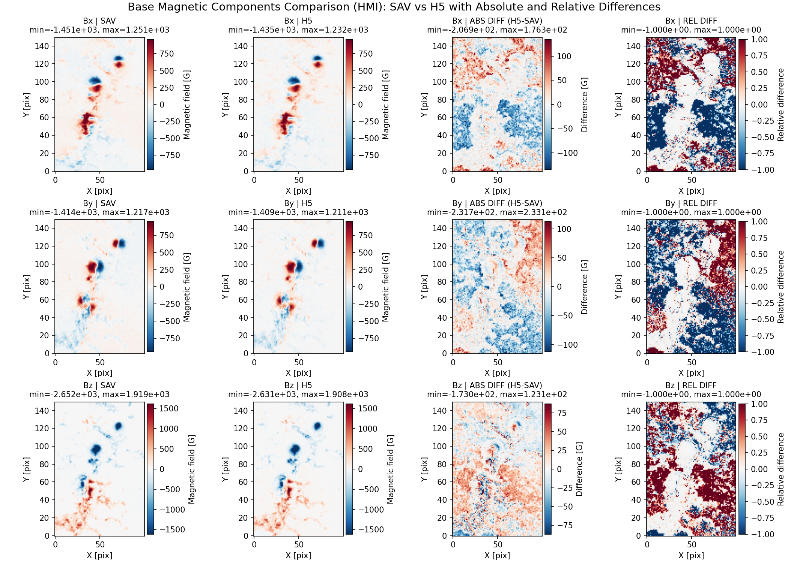
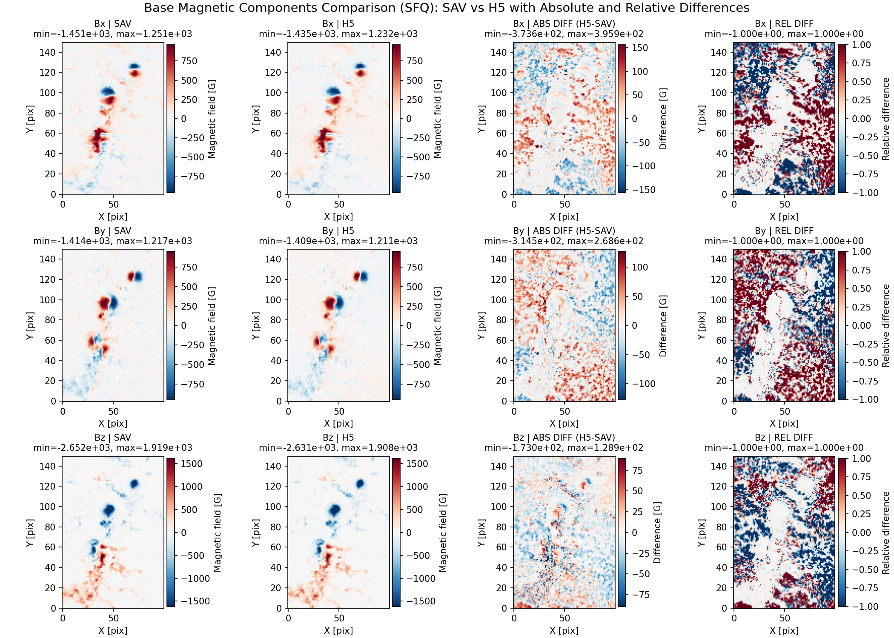

# pyAMPP vs GX/IDL Parity Review
## Living Presentation

Date started: 2026-02-11  
Owner: Gelu + Codex  
Scope: stage schema alignment + physics parity validation

---

## Goals

- Validate that HDF5 models generated by `pyAMPP` are consistent with IDL `gx_ampp` SAV models.
- Prioritize physically relevant agreement (active region / sunspot magnetic structures).
- Track parity progress stage-by-stage before downstream `gximagecomputing` updates.

---

## Current Milestone (Completed)

## Latest Full Assessment

- Full stage-by-stage H5 vs SAV assessment is available at:
  - `reports/parity_review/PARITY_FULL_STAGE_ASSESSMENT.md`
  - `reports/parity_review/PARITY_FULL_STAGE_ASSESSMENT.pdf`
- Includes HMI+SFQ tables for `NONE/POT/BND/NAS/NAS.GEN/NAS.CHR` and referenced base/z=0 comparison figures.

### Base map parity check (H5 vs SAV)

- Inputs:
  - HMI pair: `test.chr.newschema.h5` vs `test.chr.sav`
  - SFQ pair: `test.chr.sfq.newschema.h5` vs `test.chr.sfq.sav`
- New visualization style:
  - 3x4 panel per run: `SAV | H5 | ABS DIFF | REL DIFF`
  - Relative map uses bounded metric:
    - `rel = (H5 - SAV) / (abs(H5) + abs(SAV))`, bounded to `[-1, 1]` except zero-denominator pixels.

---

## HMI Base Comparison



Short conclusion:

- Structured magnetic regions align well in `Bx`, `By`, `Bz`.
- Residuals are strongest in low-signal/background areas and are largely pattern-noise-like.
- `Bz` parity is strongest visually and numerically.

---

## SFQ Base Comparison



Short conclusion:

- SFQ pair also shows good structural agreement in active regions.
- Background relative differences remain larger than desired but do not dominate key AR structure.
- No clear sign/axis catastrophe in current base maps.

---

## Quantitative Snapshot (Current)

Source JSON:

- `data/compare_base_hmi_newschema_vs_sav.json`
- `data/compare_base_sfq_newschema_vs_sav.json`

Relative (bounded) MAE summary:

- HMI: `Bx=0.5118`, `By=0.5419`, `Bz=0.4644`
- SFQ: `Bx=0.4626`, `By=0.4701`, `Bz=0.4329`

Direct correlation summary:

- HMI: `corr(Bx)=0.967`, `corr(By)=0.975`, `corr(Bz)=0.996`
- SFQ: `corr(Bx)=0.963`, `corr(By)=0.972`, `corr(Bz)=0.996`

---

## Interpretation

- Base-level parity is acceptable to proceed.
- Remaining mismatch magnitude appears concentrated in horizontal components and low-signal regions.
- Next checks should focus on how boundary maps propagate into coronal fields (`corona/bx,by,bz`) and line/chromo stages.

---

## Next Sections To Add

1. `corona z=0` consistency vs `base` (`bx/by/bz`) in each model.
2. Full-cube `corona/bx/by/bz` parity (H5 vs SAV-derived representation).
3. `lines` stage parity checks and voxel-id / corona-base consistency.
4. CHR-stage parity and downstream impact on microwave rendering in `gximagecomputing`.
5. Downloader/runtime parity follow-up: for the same request on `2025-11-26T15:34:31`, pyAMPP download stage took `566.82s` vs IDL `158.603s`; investigate request batching/export wait behavior and HMI file-size/product differences.

---

## Repro Commands (Current Section)

```bash
# JSON metrics (bounded relative mode)
python pyampp/tests/compare_base_maps.py \
  --h5 ../gximagecomputing/test_data/test.chr.newschema.h5 \
  --sav ../gximagecomputing/test_data/test.chr.sav \
  --relative-mode bounded \
  --out /tmp/compare_base_hmi_newschema_vs_sav.json

python pyampp/tests/compare_base_maps.py \
  --h5 ../gximagecomputing/test_data/test.chr.sfq.newschema.h5 \
  --sav ../gximagecomputing/test_data/test.chr.sfq.sav \
  --relative-mode bounded \
  --out /tmp/compare_base_sfq_newschema_vs_sav.json

# 3x4 panel plots
python pyampp/tests/plot_base_maps_comparison.py \
  --h5 ../gximagecomputing/test_data/test.chr.newschema.h5 \
  --sav ../gximagecomputing/test_data/test.chr.sav \
  --relative-mode bounded \
  --out /tmp/base_compare_panel_hmi_newschema_vs_sav_3x4.png

python pyampp/tests/plot_base_maps_comparison.py \
  --h5 ../gximagecomputing/test_data/test.chr.sfq.newschema.h5 \
  --sav ../gximagecomputing/test_data/test.chr.sfq.sav \
  --relative-mode bounded \
  --out /tmp/base_compare_panel_sfq_newschema_vs_sav_3x4.png
```
